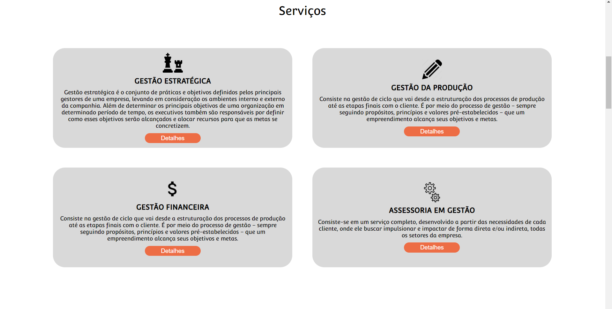
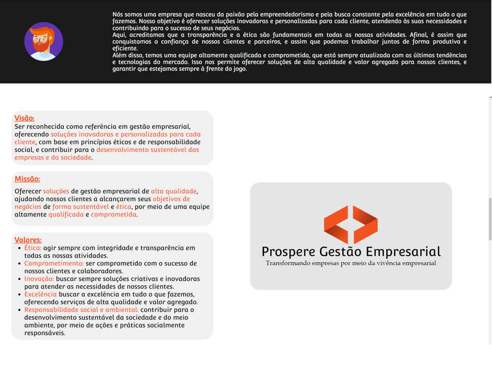
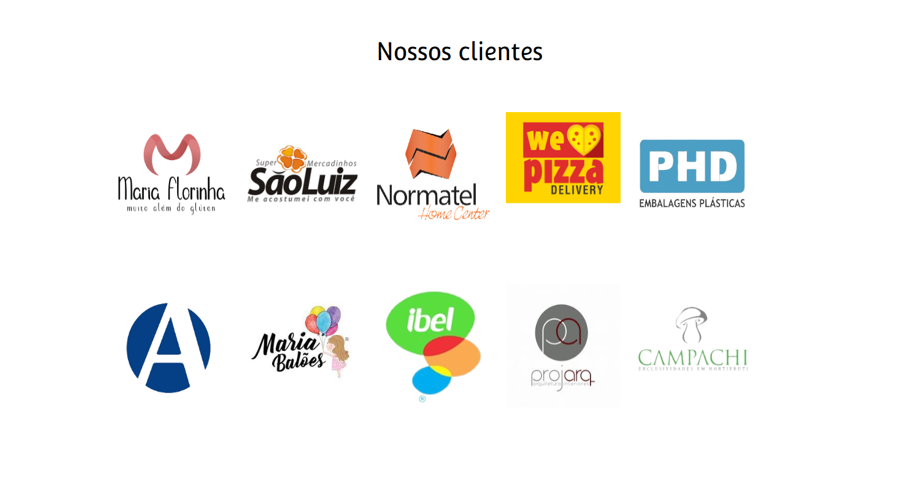
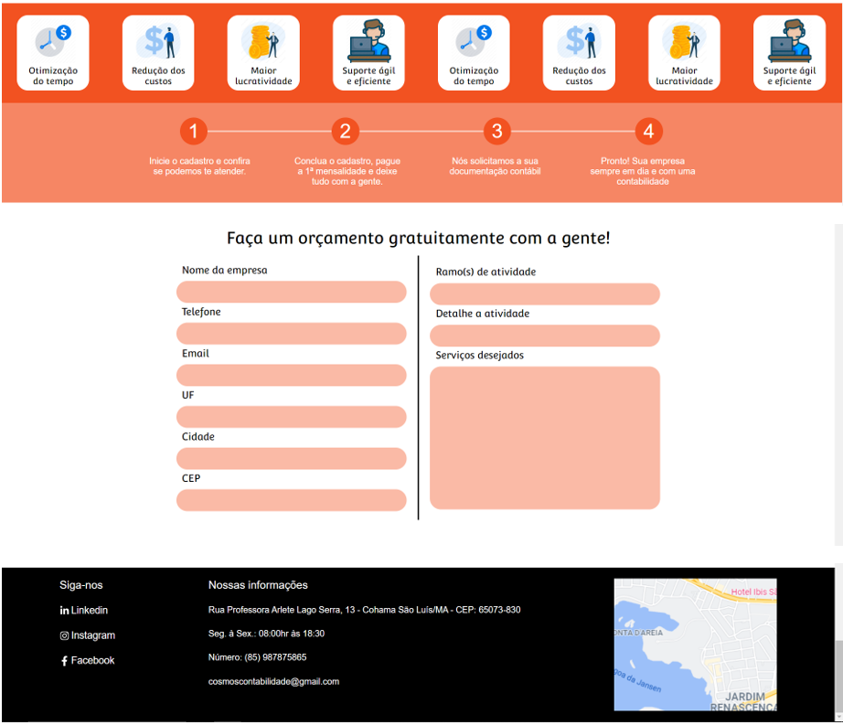

# teste-empresa-junior-include

Site desenvolvido seguindo prototipação no Figma para um teste de desenvolvedor na empresa júnior Include da Universidade Federal do Ceará

Iniciando projeto

De o seguinte comando para instalar todas as dependencias necessárias para o projeto:

- npm install

Para executar de o seguinte comando:

- npm run dev

Tecnologias utilizadas;

- HTML, CSS
- React
- TypeScript
- StyledComponents
- React Hook Form
- yup
- React Toastify
- React icons

Protótipo

